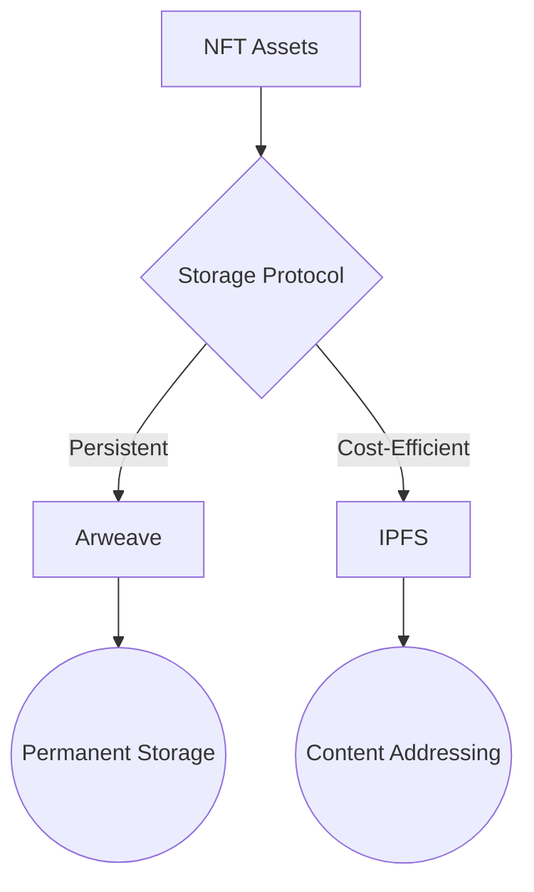

# Artist Studio - Web3 NFT Creation Platform

[](https://soliditylang.org/)
[](https://ipfs.tech/)
[](https://www.arweave.org/)
[](https://reactjs.org/)

## 🚀 Features
**Core Functionalities**
- 🎨 NFT Minting with on-chain metadata
- 🗃️ Permanent storage using Arweave blockchain
- ✒️ Immutable article publishing system
- 🔒 ERC-721 compliant ownership management

## 🌐 Dual Storage Architecture


## 🛠 Tech Stack
| Category       | Technologies                          |
|----------------|---------------------------------------|
| Smart Contracts| Solidity, Hardhat, OpenZeppelin       |
| Frontend       | React, TypeScript, Web3.js            |
| Storage        | IPFS, Arweave, Bundlr Network         |
| Testing        | Hardhat Network, Chai, Mocha          |

## 📦 Installation
```bash
# Install core dependencies
npm install ipfs-http-client arweave @bundlr-network/client
npm install arweave @bundlr-network/client
```

## 📚 Storage Comparison
| Feature        | Arweave          | IPFS             |
|----------------|------------------|------------------|
| Persistence    | Permanent        | Pinned required  |
| Cost Model     | One-time payment | Recurring        |
| Data Access    | HTTP gateway     | Peer-to-peer     |
| Data Structure | Blockchain-based | Content-address  |

## 🚀 Deployment Workflow
1. **IPFS Deployment**
```bash
npm run ipfs:start  # Start local IPFS node
```

2. **Arweave Deployment**
```bash
npm run arweave:fund  # Fund Arweave wallet
```

3. **Contract Deployment**
```bash
npx hardhat ignition deploy ./ignition/modules/NFTModule.js --network localhost
```

## 📚 Usage Scenarios
**When to use IPFS:**
- Temporary storage needs
- Frequent content updates
- Community-driven content

**When to use Arweave:**
- Permanent archival
- Legal documents
- High-value digital assets